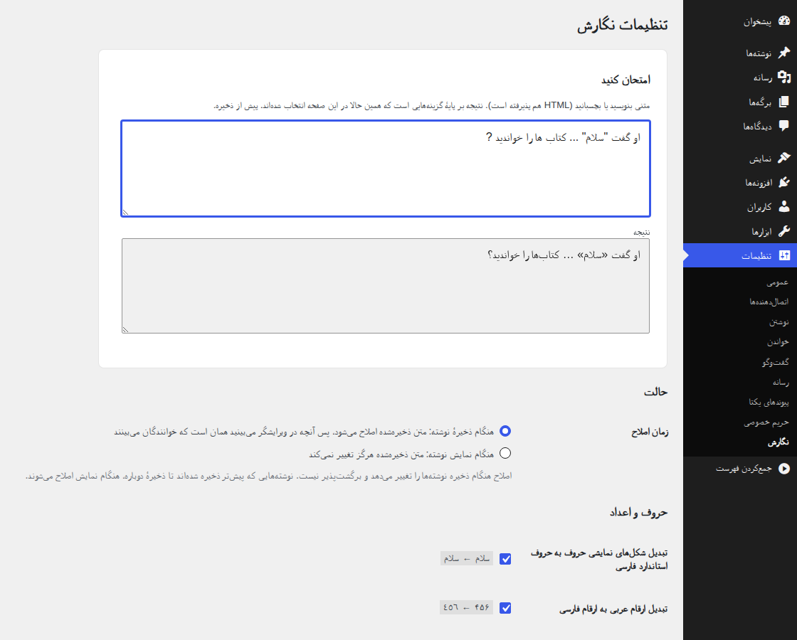

# Negaresh

Negaresh (نگارش) is a WordPress plugin that fixes Persian (Farsi) typography: half spaces, Persian
digits, punctuation, quotes and more. [فارسی](README.fa.md)



## Download
Download `negaresh.zip` from the latest release on the [releases page](https://github.com/LordArma/negaresh/releases),
then upload it in *Plugins → Add New → Upload Plugin*.

## Requirements
* WordPress 5.8 or newer (tested up to 7.1)
* PHP 7.4 or newer

## Features
Built on [Virastar](https://github.com/AlirezaSedghi/Virastar) (a patched copy ships with the plugin).

* **Fix before saving or on display.** Correct the stored text when a post is saved (the default
  for new installs), or fix only what is displayed and never change the stored text.
* **32 rules** to switch on or off at *Settings → Negaresh*, each with an example, and a
  **Try it** box that fixes your own text with the boxes as they are checked.
* **Only text is changed**: HTML tags, attributes, links, entities, shortcodes and code
  (`pre`, `code`, `script`, `style`, ...) are left exactly as they are; so is English only text.
* **Leave a post alone** from the editor sidebar (or the classic editor box), or part of a post
  with the CSS class `negaresh-skip` / `data-negaresh="off"`.
* **Fix this post now** in the block editor; Undo reverts it.
* **Fix existing posts** in *Tools → Negaresh* or with WP-CLI, after seeing the changed lines.
  The text before each change is kept in the post's revisions.
* Titles and hand written excerpts (optional), post types, feeds and REST API scope.
* Persian translation included.

## WP-CLI
```bash
wp negaresh fix                      # what would change (nothing is saved)
wp negaresh fix --apply --diff       # fix every post in scope and print the changed lines
wp negaresh fix 12 34 --apply        # only these posts
wp negaresh text "کتاب ها ?"          # fix a piece of text (or pipe it in)
```

## Development
Tooling lives at the repository root and is not part of the plugin zip.

```bash
composer install
composer check                       # coding standards, static analysis, unit tests
tests/e2e/run.sh                     # end to end in a real WordPress (Docker)
BROWSER=1 tests/e2e/run.sh           # + the admin screens in headless Chromium
```

Releases are published by pushing a `v*` tag (see `.github/workflows/release.yml`).
See [CHANGELOG.md](CHANGELOG.md) for what changed.
